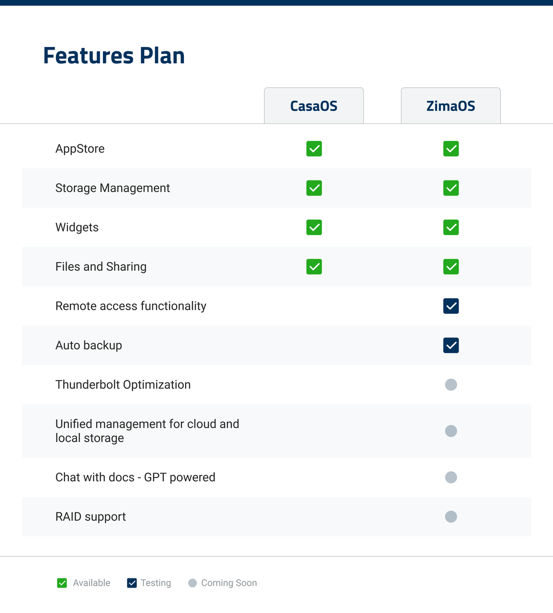
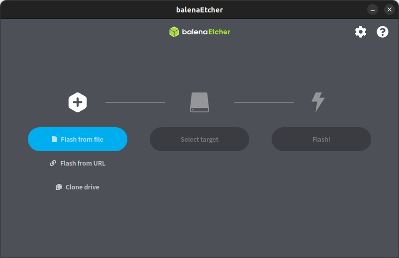
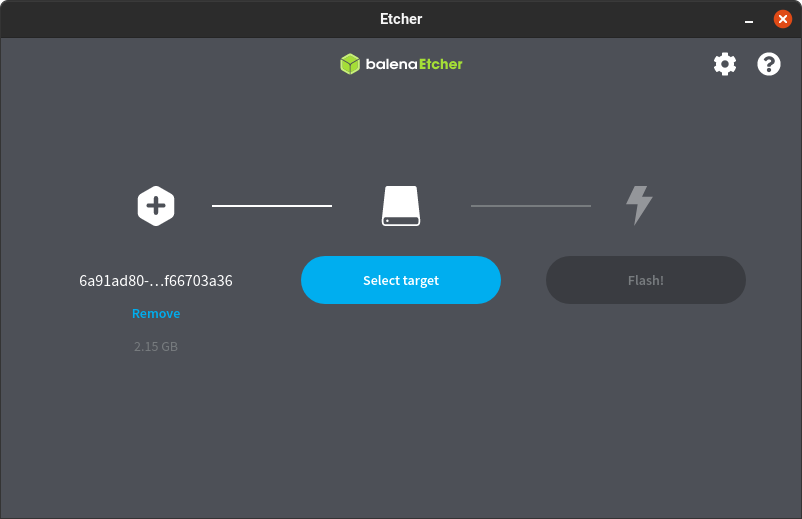
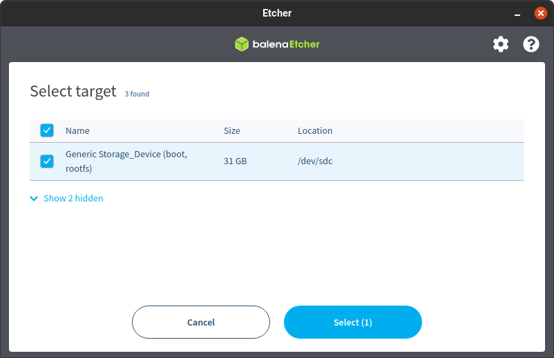
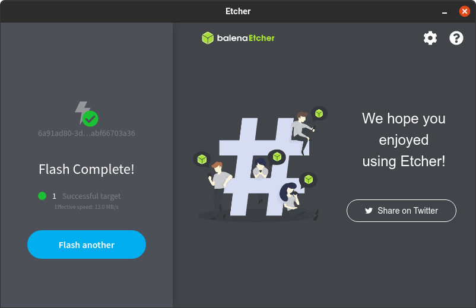

[release]: https://github.com/IceWhaleTech/zimaos-rauc/releases
[release-badge]: https://img.shields.io/github/v/release/IceWhaleTech/zimaos-rauc?include_prereleases&style=flat-square
[download]: https://github.com/IceWhaleTech/zimaos-rauc/releases
[download-badge]: https://img.shields.io/github/downloads/IceWhaleTech/zimaos-rauc/total?style=flat-square
[community]: https://icewhale.community/t/welcome-to-the-zimaos-open-beta-program/295
[community-badge]: https://img.shields.io/badge/Contact-community-blue?style=flat-square

<div align="center">


# ZimaOS Open Beta Program
[![release][release-badge]][release]
[![download][download-badge]][download]
[![community][community-badge]][community]
</div>

Welcome to join the open beta program of ZimaOS. ZimaOS is evolved from CasaOS, and we have built a release version of ZimaOS for better hardware compatibility and update experience. It will perfectly adapt to the Zima series hardware and also be compatible with x86-64 systems with UEFI.

It is built using Buildroot and has stable OTA update functionality. Based on CasaOS, we have built a series of new applications. You can find the specific differences between it and CasaOS from the table below:

<div align="center">

   
</div>

## Discussion

This project is just for releasing test images, if you want to discuss related issues, feel free to go to our forum.
[Icewhale Communit](https://icewhale.community/t/welcome-to-the-zimaos-open-beta-program/295) 

## Distribution Features

- Lightweight and memory-efficient
- Minimized I/O
- Over The Air (OTA) updates
- Offline updates
- Better disk management capabilities

## Supported hardware

- ZimaBoard
- ZimaBlade
- ZimaCube（in preparation）
- Generic x86-64 (e.g. Intel NUC)

## Getting Started

To boot ZimaOS, the BIOS needs to have UEFI boot mode enabled and Secure Boot disabled.

Next, we need to write the ZimaOS image to the “boot medium”, which is the medium your zima device or x86-64 hardware will boot from when it is running ZimaOS.

### Extra
[Zima-screen0.webm](https://github.com/IceWhaleTech/zimaos-rauc/assets/9485680/41351861-ec4c-45b7-bbc6-3c796607e4c4)

The ZimaOS USB installation image has been released. Use Balena Etcher to burn the installation image to a USB disk. Now you can use this installer to install ZimaOS to any internal hard disk.

Note that it still requires UEFI boot.
```text
https://zimaos.icewhale.io/zimaos-rauc/latest/zimaos_zimacube_installer.img
```
We have also released images in a variety of VM formats, which you can download as needed from the Release page.

---

Typically an internal medium like S-ATA hard disk, S-ATA SSD, M.2 SSD, or a non-removable eMMC is used for the x86-64 boot medium. Alternatively, an external medium can be used such as a USB SDD, though this is not recommended.

To write the ZimaOS image to the boot medium on your x86-64 hardware, there are 2 different methods:

1. Write the ZimaOS disk image from your desktop computer directly to the boot medium (e.g. using a USB to S-ATA adapter). If you can use this method, proceed to “Write the image to your boot medium” and follow all steps. If you have non-removable internal mediums or don’t have the necessary adapter, try the next method instead.
2. Create a “live operating system” on a USB device running e.g. Ubuntu (how-to guide). Insert it into your system and boot the live operating system. Then follow from step 2 in “Write the image to your boot medium”.

### Ubuntu dependencies for Etcher

When installing Etcher on Ubuntu you may need to install the fuse dependency first, to do this run the following commands in the terminal:

```bash
sudo add-apt-repository universe
sudo apt update
sudo apt install libfuse2
```

### Write the image to your boot medium

1. Attach the ZimaOS boot medium (storage device) to your computer.
2. Download and start Balena Etcher. You may need to run it with administrator privileges on Windows.
3. Download the image to your computer.

   - Copy the URL for the image.
   - If there are multiple links below, make sure to select the correct link for your version of Generic x86-64.

     ```text
     https://zimaos.icewhale.io/zimaos-rauc/latest/zimaos_zimacube.img.xz
     ```

   Select and copy the URL or use the “copy” button that appear when you hover it

4. Paste the URL into your browser to start the download.
5. Select Flash from file and select the image you just downloaded.

   - Flash from URL does not work on some systems.

    

6. Select target.

    

7. Select the boot medium (storage device) you want to use for your installation.

    

8. Select **Flash!** to start writing the image.

    

9. When Balena Etcher has finished writing the image, you will see a confirmation.

    

### Start up your Zima device or Generic x86-64 device

- If you used your desktop system to write the ZimaOS image directly to a boot medium like an S-ATA SSD, connect this back to your Generic x86-64 system.
- If you used a live operating system (e.g. Ubuntu), shut it down and remove the live operating system USB device.
  1. Plug in an Ethernet cable that is connected to the network.
  2. Power the system on. If you have a screen connected to the Zima device or Generic x86-64 system, after a minute when you see `ZimaOS Welcome banner`, it will show the link of webgui. or you can visit ZimaOS via https://findzima.com.
  3. Default ssh login/password is `root/testonly`

## Installation on Proxmox

[Follow the link](https://github.com/IceWhaleTech/zimaos-rauc/issues/5).  Thanks [@silycr](https://github.com/silycr) for the tutorial!
