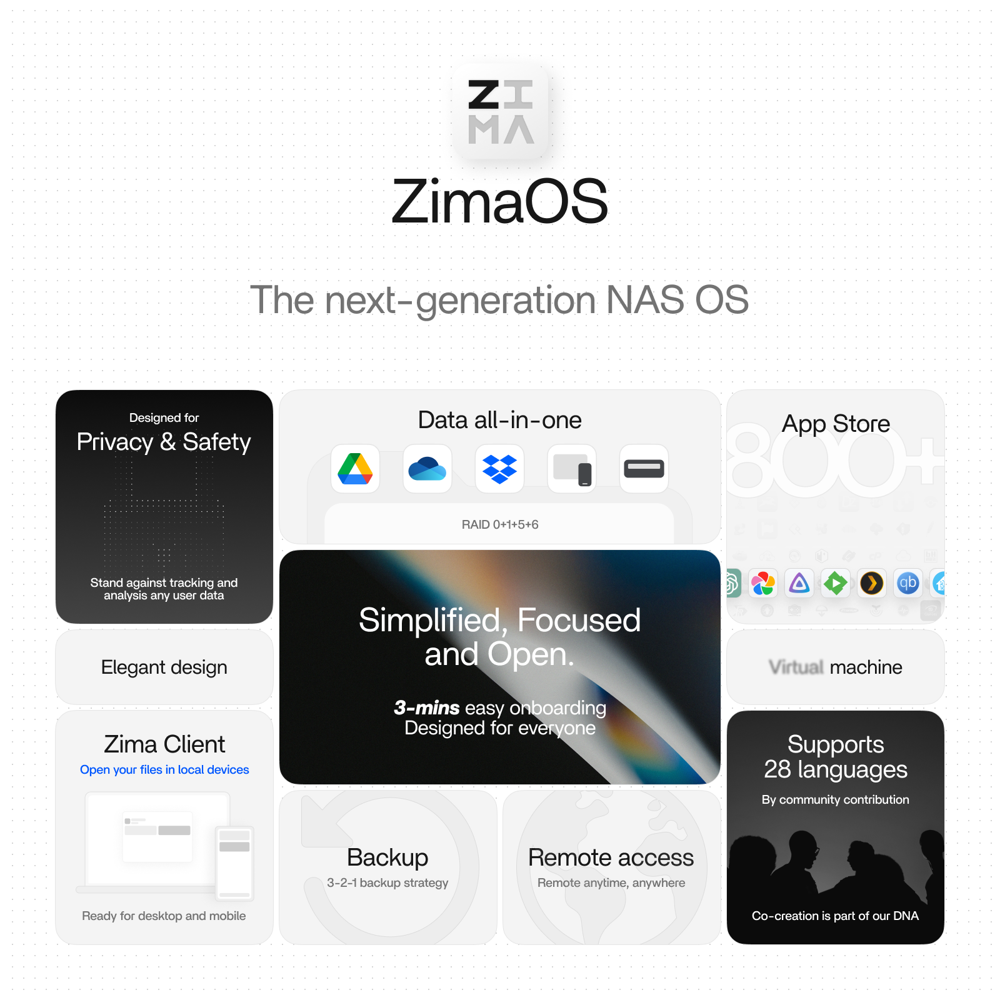

[release]: https://github.com/IceWhaleTech/zimaos-rauc/releases
[release-badge]: https://img.shields.io/github/v/release/IceWhaleTech/zimaos-rauc?include_prereleases&style=flat-square
[download]: https://github.com/IceWhaleTech/zimaos-rauc/releases
[download-badge]: https://img.shields.io/github/downloads/IceWhaleTech/zimaos-rauc/total?style=flat-square
[community]: https://icewhale.community/t/welcome-to-the-zimaos-open-beta-program/295
[community-badge]: https://img.shields.io/badge/Community-Forum-Blue?style=flat-square

# ZimaOS Public Evaluation Program

[![release][release-badge]][release]
[![download][download-badge]][download]
[![community][community-badge]][community]

Welcome to join the public evaluation program of ZimaOS. ZimaOS is evolved from CasaOS, and we have built a release version of ZimaOS for better hardware compatibility and update experience. It will perfectly adapt to the Zima series hardware and also be compatible with x86-64 systems with UEFI.

   

It is built using Buildroot and has stable OTA update functionality. Based on CasaOS, we have built a series of new applications. You can find the specific differences between it and CasaOS from the table below:

   

## Discussion

This project is just for releasing test images, if you want to discuss related issues, feel free to go to our forum.
[Icewhale Community](https://icewhale.community/t/welcome-to-the-zimaos-open-beta-program/295)

## Distribution Features

- Lightweight and memory-efficient
- Minimized I/O
- Over The Air (OTA) updates
- Offline updates
- Better disk management capabilities

## Supported hardware

- ZimaBoard
- ZimaBoard2
- ZimaBlade
- ZimaCube
- Generic x86-64 (e.g. Intel NUC)

## Getting Started

### Installation

1. Preparation
   - Enable UEFI boot in BIOS/UEFI and disable Secure Boot.
   - Back up any important data on the target drive. The selected disk will be erased.

2. Download the image
   - Open [`Releases`](https://github.com/IceWhaleTech/ZimaOS/releases/latest) and download the installer image.
   - Pick the file named `zimaos_XXXXX_installer.img` (`XXXXX` varies by version).

3. Create the USB installer
   - Use Balena Etcher (Windows/macOS/Linux): [`https://etcher.balena.io/`](https://etcher.balena.io/)
   - Steps:
     1) Launch Etcher.
     2) Select the downloaded `*.img` file.
     3) Choose the target USB drive (verify the correct device).
     4) Click Flash, wait for completion, then safely eject the USB drive.

   

      
   

   

      
   

   

      
   

   

      
   

   

      
   

4. Install ZimaOS
   - Insert the USB installer into the target device (Zima hardware or generic x86‑64 PC).
   - Open the BIOS/Boot Menu and boot from the USB device in UEFI mode.
   - Follow the on‑screen installer to select the target disk and confirm installation (this erases the disk).
   - When installation completes, reboot as prompted and remove the USB installer.
   - Boot from the installed disk (UEFI) to start ZimaOS and finish the initial setup.

[ZimaOS.webm](https://github.com/user-attachments/assets/cb81bf93-a89b-46a8-afc6-056efb5483e3)

## Installation on Proxmox

[Follow the link](https://github.com/IceWhaleTech/zimaos-rauc/issues/5).  Thanks [@silycr](https://github.com/silycr) for the tutorial!
